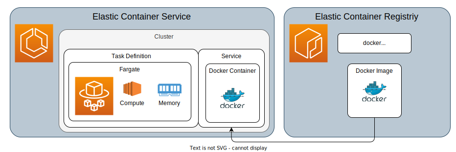

# Local to cloud
The goal is to provide a development flow that covers mulitple deployment envirments using the same code base
* Local native deployment using python venv and node installs
* Docker containers with docker compose commands
* Cloud deployment with Lambdas and ECS Fargate Tasks

## Orchestration
* Primary services are ones that manipulate data and those are subject to orchestration
* Secondary services are used for stateless and instant data transformation such as REST API endpoints
* Orchestration is based on data flow only, which means that services do not exchange control events but rather events triggered on data production
* Local ochestration is based on MQTT which mirrors main artifacts creation in cache (A main artifact is a cache path)
* Global or cross services orchestatrion is based on an S3 bucket with lambdas for webhooks notification or services triggers

## goals

* Create an ECS task that watches an S3 Object, triggers when it is updated, process it then stops
* Host stateless services for simple data transformation

## related work
* https://github.com/MicroWebStacks/copper
* https://github.com/MicroWebStacks/markdown-rag-services

# S3
testing s3 access

- created a bucket => BUCKET_NAME
- provide perissions to IAM user

# ECS



```bash
aws ecr get-login-password --region eu-central-1 | docker login --username AWS --password-stdin 031028648877.dkr.ecr.eu-central-1.amazonaws.com

docker compose build server

docker tag aws-sandbox-server:latest 031028648877.dkr.ecr.eu-central-1.amazonaws.com/microweb-containers:latest

docker push 031028648877.dkr.ecr.eu-central-1.amazonaws.com/microweb-containers:latest

```
* ECS > Clusters > HelloWebCluster > Tasks > Task running with a Task Definition
* in the Networking security group, the inboud rule for port 3000 needs to be added
# Aws pipeline options
* Sagemaker pipeline
* Step functions with Lambdas
* Fargate with triggers
* AWS Batch
* custom with EC2 Spot instances
* EKS Elastic Kubernetes Service
# Pipeline tools
* Perfect : https://docs-3.prefect.io/3.0rc/deploy/infrastructure-examples/docker
* Metaflow : https://docs.metaflow.org/introduction/what-is-metaflow
* AWS Step Functions
* Dagster : https://dagster.io/
* Flyte : https://flyte.org/
* Argo Workflows : https://argo-workflows.readthedocs.io/en/latest/quick-start/
* Custom Python and Docker
