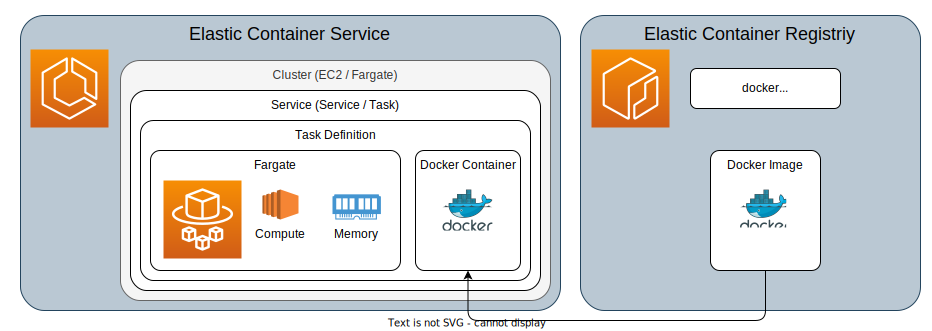

# serverless

# S3
testing s3 access

(used GPT4 assistance)
test successful

- created a bucket => BUCKET_NAME
- created an access point on the Bucket => ACCESS_POINT_ARN
- created IAM user with permission "AmazonS3FullAccess" => aws_access_key_id, aws_secret_access_key

# ECS



```bash
aws ecr get-login-password --region eu-central-1 | docker login --username AWS --password-stdin 031028648877.dkr.ecr.eu-central-1.amazonaws.com

docker compose build server

docker tag aws-sandbox-server:latest 031028648877.dkr.ecr.eu-central-1.amazonaws.com/microweb-containers:latest

docker push 031028648877.dkr.ecr.eu-central-1.amazonaws.com/microweb-containers:latest

```
* ECS > Clusters > HelloWebCluster > Tasks > Task running with a Task Definition
* in the Networking security group, the inboud rule for port 3000 needs to be added
# Aws pipeline options
* Sagemaker pipeline
* Step functions with Lambdas
* Fargate with triggers
* AWS Batch
* custom with EC2 Spot instances
* EKS Elastic Kubernetes Service
# Pipeline tools
* Perfect : https://docs-3.prefect.io/3.0rc/deploy/infrastructure-examples/docker
* Metaflow : https://docs.metaflow.org/introduction/what-is-metaflow
* AWS Step Functions
* Dagster : https://dagster.io/
* Flyte : https://flyte.org/
* Argo Workflows : https://argo-workflows.readthedocs.io/en/latest/quick-start/
* Custom Python and Docker
